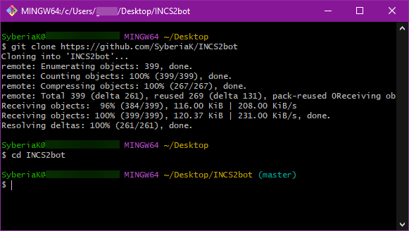

# INCS2 Bot - Localization system

If you want to contribute - make sure that translation into your preferred language is not complete yet by looking at [Progress](#progress) section.
Then check [Contributing](#contributing) section to know how to start translating

---

## Progress

Here you can see translations' progress and contributors' list:

| Code | Language  |    Progress     |         Summary          |        Contributors        |
|:----:|-----------|:---------------:|:------------------------:|:--------------------------:|
|  gb  | English   | ██████████ 100% |         built in         |                            |
|  ru  | Russian   | ██████████ 100% |         built in         |                            |
|  fa  | Persian   | ████████▒▒ 80%  |       tags missing       |    [@A460N] (telegram)     |
|  tr  | Turkish   | ████████▒▒ 80%  |       tags missing       |   [@ITMiroN] (telegram)    |
|  uz  | Uzbek     | █████████▒ 90%  | user_gamestats_text left |   [@d1az1337] (telegram)   |
|  uk  | Ukrainian | ██████████ 100% |        fully done        | [akimerslys], [Agent47Dev] |

## Contributing 

### Prerequirements

- GitHub account ([sign up](https://github.com/signup))
- Git ([download](https://git-scm.com/))

### Steps

1. Fork this repository. [100%]
   \
   
2. Open Git Bash and clone the forked repository: `git clone {your fork link}`.
   \
   Then use `cd INCS2bot`.
   \
   
3. Create a new repository branch and checkout to it using `git checkout -b {branch name}`.
   \
   
4. Open the repository folder. In `l10n/data/` folder, find prefered lang file.
   - If there is no such file, you can create it by yourself.
     \
     Just copy `en.json` and rename it with ISO 639-1 code of prefered language (e.g. `de.json`).
      - [List of ISO 639-1 codes](https://en.wikipedia.org/wiki/List_of_ISO_639-1_codes)
5. Open the file and start translating it based on string keys and original text.
   - We highly recommend checking the bot functionality to have more text context.
6. You can also add some tags in your language to `tags.json`.
7. In Git, add new files, then commit and push all the changes.
   \
   
8. Submit a pull request to the original repository and wait for our feedback.
   \
   

[@A460N]: https://t.me/A460N
[@ITMiroN]: https://t.me/ITMiroN
[@d1az1337]: https://t.me/d1az1337
[akimerslys]: https://github.com/akimerslys
[Agent47Dev]: https://github.com/Agent47Dev